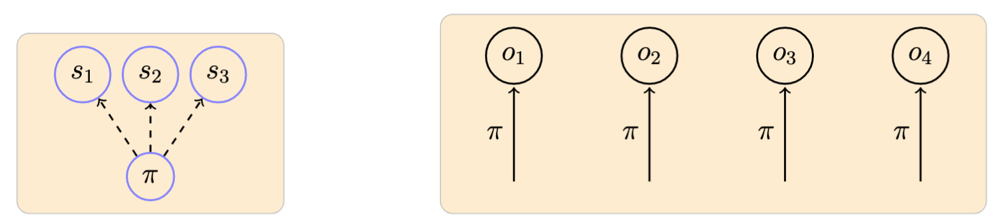
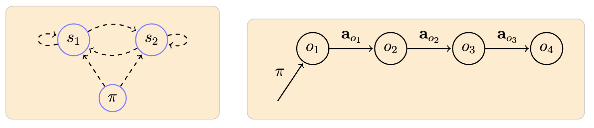
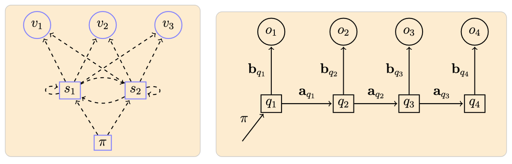

# Classification

## VQ Based Classification

Along with the probabilistic methods (see below),
and as a means to further evaluate the clustering/VQ mechanisms,
we also include a classification method
based on the quantization distortion measure.

- **VQ Learning**: 
  A codebook $C^{(u)}$ is generated for each class $u$ 
  using the designated training instances $\{a\}$ for that class.

- **VQ Classification**: 
  Classification of a particular unit instance 
  $a = \langle a_1, \ldots, a_T \rangle$ 
  is given by the trained codebook that gets
  the minimum average distortion in the quantization of $a$: 

    $$
    u^* = \operatorname{argmin}\limits_{u=1}^U d(a, C^{(u)})
    $$

    where $d(a, C^{(u)})$ is defined as the average quantization distortion
    over the vectors in $a$ when using $C^{(u)}$.

**Probabilistic methods**

In each of the methods below, by using the training data in a supervised manner,
we generate a set of models
$H = \{h_1, \ldots, h_R\}$, one model for each class such that the 
model $h_r$ learns to recognize $u_r$ instances in a probabilistic sense.
Subsequently, given a song unit instance $o$, we find its most probable 
$h* \in H$, that is, $h* = \operatorname{argmax}_h P[h|o]$,
as the rule for classification [5, 6]. 
By using Bayes' formula and assuming $P[h]$ equiprobable
-in other words, by using a maximum likelihood criterium-
the classification of $o$ is then given by $h* = \operatorname{argmax}_h P[o|h]$.

*Note*: In these methods, the underlying codebooks for quantization are those
generated with all training song unit instances regardless of class.

## Naive Bayes

The Naive Bayes (NB) classifier is a simple method shown to be
quite effective in many practical applications [5].
Its core underlying assumption is that the observed symbols for
a class are independent from each other.

A Naive Bayes model is defined by:

- $N$: Number of attributes (observable symbols)
- $\pi$: Observation probability distribution

Example of a model with 3 observable symbols $\{s_1, s_2, s_3\}$
and an associated observed sequence:[^notation]

- **NB Learning**: A model for class $u$ is generated with the designated training observation
  sequences using an $m$-estimate (pseudocounts) to determine the $\pi$ distribution [5].
  Each element of the distribution is determined as:

    $$
    \pi_m^{(u)} \gets \frac{n_m + 1}{n + M}
    $$

    where $n_m$ is the number of quantized symbols equal to $m$ and $n$ is the total number
    of symbols across all training sequence from class $u$.

- **NB Classification**: The probability of a sequence $o$ given $a$ model is: 

    $$
        P[o | \pi^{(u)}]
          =
            \prod\limits_{t=1}^T P[o_t\ |\ \pi^{(u)}]
          =
            \prod\limits_{t=1}^T \pi_{o_t}^{(u)}
    $$

    With this, as indicated above, we use a maximum likelihood criterium for classification:

    $$
    u^* = \operatorname{argmax}_u \prod\limits_{t=1}^T \pi_{o_t}^{(u)}
    $$

## Markov Chain

A first-order Markov chain model (MM) allows us to start incorporating
a time dependency in the observed sequences [6].
In this model, for a given sequence, each observed symbol corresponds
to a state of the system, and the probability of
observing a particular symbol at time $t$
only depends on the symbol observed at time $t - 1$.

A Markov Chain model is defined by:

- $N$: Number of states (observable symbols in our case)
- $\pi$: Initial state probability distribution
- $a$: State probability distributions

Example of a model with 2 observable symbols $\{s_1, s_2\}$
and an associated observed sequence:

- **MM Learning**: Basically done as with NB learning,
  here we also use pseudocounts to determine
  the $\pi$ and $a$ distributions based on the given training sequences.

- **MM Classification**: With $\mathcal{M} = (\pi, a)$ denoting a Markov chain model,
  the probability of a sequence $o$ given $\mathcal{M}$ is:

    $$
    P[o|\mathcal{M}] =
      \pi_{o_1} \prod\limits_{t=1}^{T-1} a_{o_t, o_{t+1}}
    $$

    which we use for our maximum likelihoodclassification:

    $$
    u^* = \operatorname{argmax}_u P[o | \mathcal{M}^{(u)}]
    $$

## Hidden Markov Modeling

In HMM, states no longer represent the observable elements of the
underlying stochastic process as in the Markov chain case.
They are now hidden random variables on which
output symbols are defined as probabilistic functions [7-9].
In this study we use discrete observation distributions.

An HMM model is defined by:

- $N$, $M$: Number of states and symbols
- $\pi$: Initial state probability distribution
- $a$: State probability distributions
- $b$: Observation symbol distributions

Example of a model with $N = 2$ states $\{s_1, s_2\}$
and $M = 3$ symbols $\{v_1, v_2, v_3\}$,
and an associated observed sequence:

- **HMM Learning**: Implemented via the Baum-Welch algorithm [7].

- **HMM Classification**: With $\lambda = (\pi, a, b)$ denoting an HMM,
  the key operation is to compute $P[o|\lambda]$,
  the probablity of a sequence given $\lambda$.
  For this we use the forward-backward algorithm [7].
  Once again, we use a maximum likelihood decision rule:

    $$
    u^* = \operatorname{argmax}_u P[o | \lambda^{(u)}]
    $$

[^notation]: Arrow notation used here and in the following: dashed lines originating from a node represent probabilities defining a particular distribution; and filled lines represent the ocurrence of a particular event according to the distribution indicated in the label.
