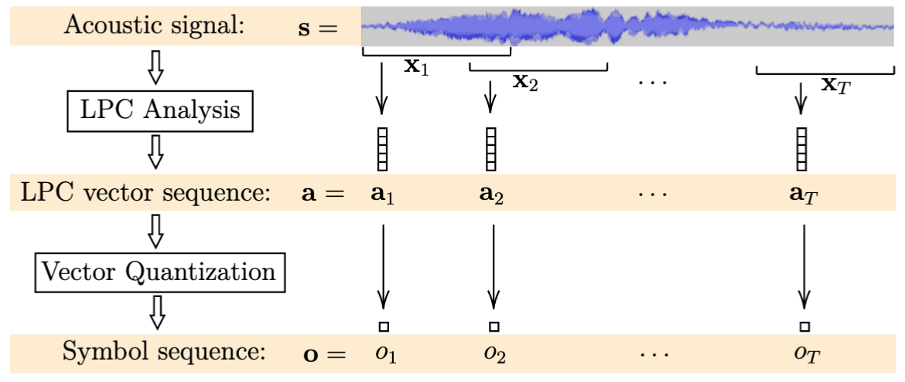
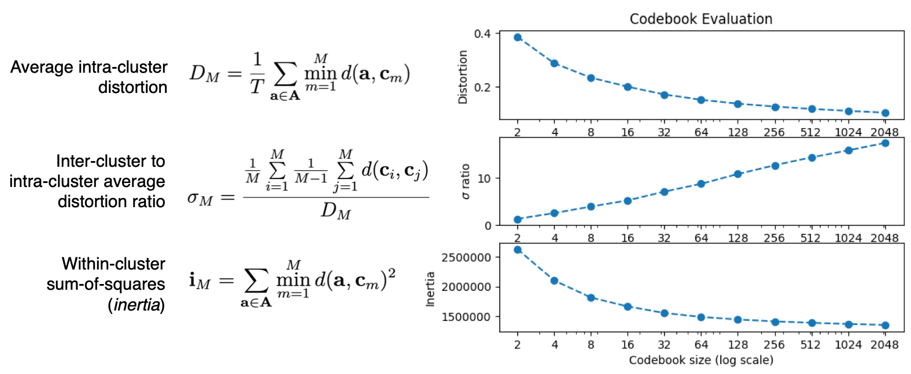
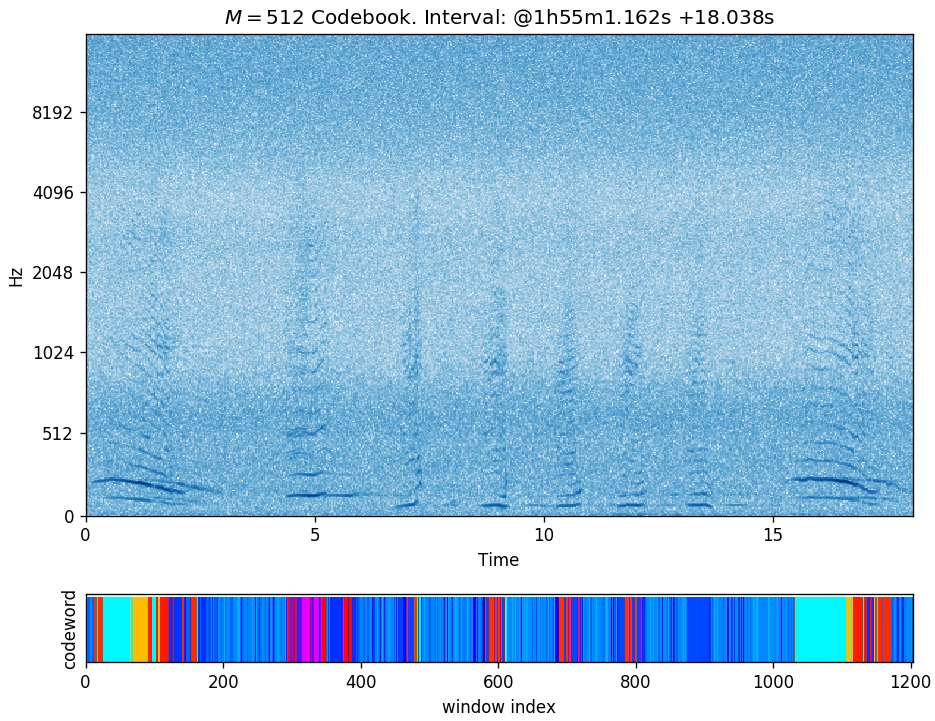

# Feature Extraction

## Linear Predictive Coding and Vector Quantization

We use linear predictive coding (LPC) [2, 3] for feature extraction.
The predictive vectors arising from this analysis are then quantized [4]
for the statistical modeling. This analysis is applied to consecutive,
overlapping time windows where the signal in each window is assumed to
be approximately stationary. The LPC analysis on a window $x_t$ results in
a vector $a_t$, which in turn is quantized into a symbol from a codebook
of size $M$.
Represented as such symbol sequences, we model the set of song unit
instances in a probabilistic manner.

The LPC and VQ relevant parameters that we investigate are:

- $P$:  Order of prediction (length of each vector $a_t$)
- $W$:  Analysis window size (duration of each $x_t$)
- $O$:  Analysis window offset
- $M$:  Codebook size (number of observable symbols)

## Codebook Generation and Evaluation

To support the vector quantization step, we run a variant of the
$k$-means algorithm for clustering where an LPC based measure of
distance (distortion) is used [4]. We generate codebooks of various
sizes and evaluate the following metrics:

where $d(a, b)$ is the distance or distortion between two LPC vectors,
$A$ is the set of training vectors, $M$ is the size of the codebook,
and $c_m$ are the centroids of the codebook. The plot in the right-hand
side of the figure above -captured from one of the runs we performed-
shows the typical behaviour of these metrics as functions of the codebook size $M$.

## Quantization example

The following is the visualization of a quantization example using
a codebook of size $M = 512$ on a ~18s interval:

<audio src="../res/selection_1h55m_18s.mp3" preload controls></audio>

The figure shows:

- Spectrogram of the selected interval.
- Corresponding assigned codeword per time window
  displayed with an arbitrary color mapping.
- The window offset used was 15ms resulting in about 1200
  windows for this interval. (Window size is 45ms.)
- Qualitatively, although not strictly required, we expect to see similarly
  colored areas when comparing regions with similar acoustic content, as seems
  to be well illustrated in the example above. (In general, this does not have
  to be the case as there is no predetermined ordering of the codewords in the
  associated codebook.)
