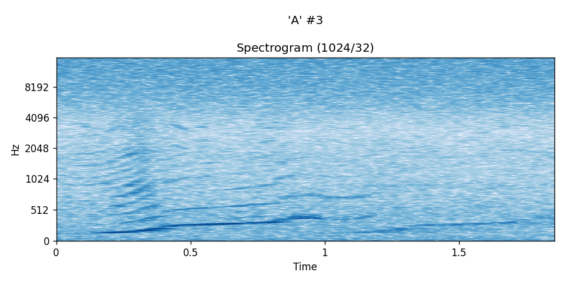
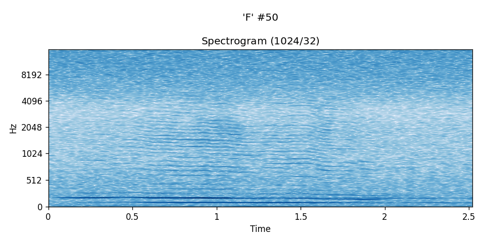
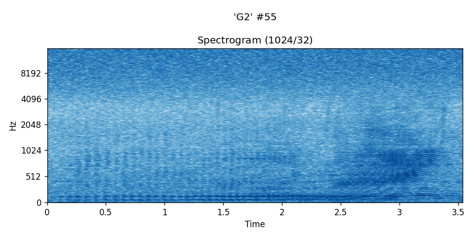

# Methods and Dataset

## Methods

- Feature Extraction:
    - Linear Predictive Coding
    - Clustering and Vector Quantization
- Classification:
    - VQ Distortion
    - Naive Bayes
    - Markov Chain Model
    - Discrete Hidden Markov Model

## Dataset

- Sound recordings acquired through the Monterey Accelerated Research System (MARS) cabled observatory [1]
- A 4.5-hour continuous and clear recording of one song session from 21 December 2016
- One singing whale, variable noise background due to changes in wind speed
- 256 kHz recording decimated to 16KHz sampling rate
- 5470 song units manually identified, segmented, and labelled in 22 different classes
- Constrained to classes having at least 200 instances
- This resulted in a total of 4539 instances across eight classes as follows:
    - `A  :  512`
    - `Bm :  608`
    - `C  :  550`
    - `E  :  713`
    - `F  :  340`
    - `G2 :  307`
    - `I3 :  324`
    - `II : 1185 `
- Each class instance set was randomly partitioned into:
    - 50% for training
    - 50% for testing

## Some prototypical song units

A DFT of window size 1024 and offset 32 was used in each of the
spectrograms below. Time axis is in seconds.

### An "A" instance:

<audio src="../res/00003.mp3" preload controls></audio>

---

### An "F" instance:

<audio src="../res/00050.mp3" preload controls></audio>

---
### A "G2" instance:

<audio src="../res/00055.mp3" preload controls></audio>

