# Results

## VQ Based Classification

We performed classification exercises
based on the vector quantization distortion measure itself
while also investigating different values of the prediction order, $P$,
and the codebook size, $M$.
This initial setup with VQ provided a general baseline
for the use and evaluation of the other methods.

In human speech analysis, $P = 4 + f_s / 1000$
(where $f_s$ is the sampling frequency)
is a typical rule of thumb to estimate an order of prediction
that provides a good representation of the overall spectral shape of the signal.
With $f_s$ = 16KHz in our case, we used $P = 20$
as a starting value to evaluate the influence of $P$ on classification accuracy.

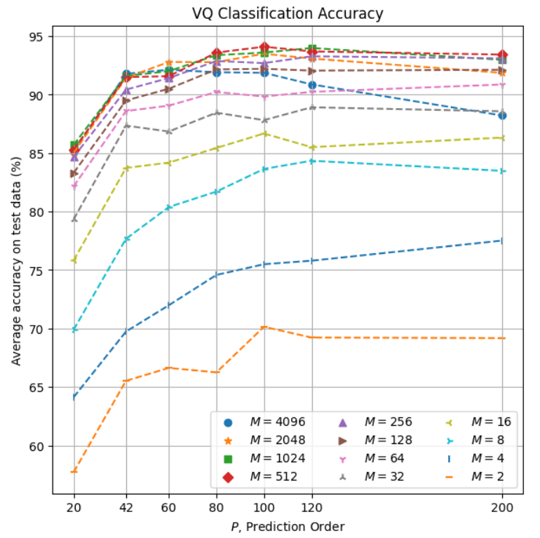

These results indicate an overall accuracy improvement with larger values of both $P$ and $M$. 

Zooming into the area of the best parameter combinations ($P \ge 42$, $M \ge 256$):

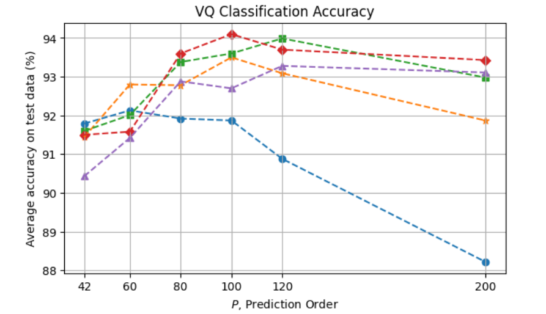

we can see that classification accuracy starts exceeding 92% from $P = 60$
for some of the codebook sizes, then peaking at around $P = 100$ to $120$,
from which point some level of overfitting can be observed for the various codebooks,
more prominenty with $M = 4096$.
The maximum accuracy obtained here is 94.1% with $P = 100$ and $M = 512$.

## Naive Bayes

Here again we evaluated the method with various values of $P$ and $M$:

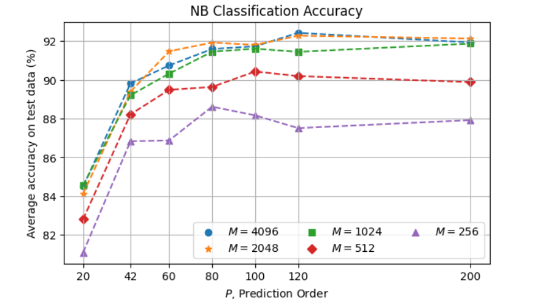

In this case, larger values of $M$ tend to result in better accuracy,
but the difference is in general not very significant among the largest codebooks, $M \ge 1024$.
The maximum accuracy obtained here is 92.4% with $P = 120$ and $M = 4096$,
with $M = 2048$ very close (92.3%).

## Markov Chain

The resulting accuracy of Markov Chain as a function of $P$ and $M$ is as follows:

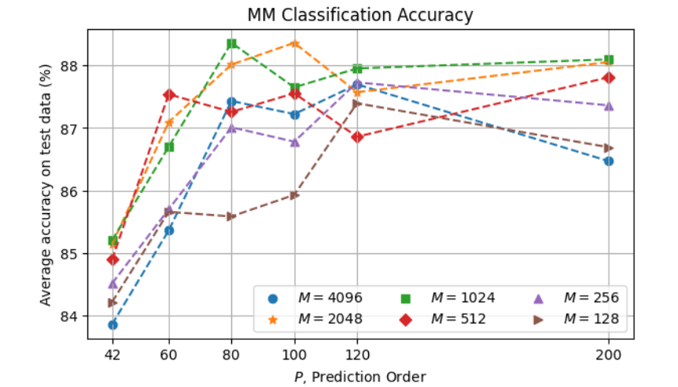

The overall degraded performance with respect to Naive Bayes
can be explained by insufficient data for a more proper training
given the significantly greater complexity of the MM model
(where the number of parameters to be estimated is cuadratic in the number of symbols,
compared to linear in the NB case).
The best accuracy 88.4% is obtained with $P = 80$ and $M = 1024$.

## Hidden Markov Modeling

We evaluated HMM with different values for the various parameters
including $P$, $N$, and $M$.
An inspection focused on $P$ and $M$ is as follows:

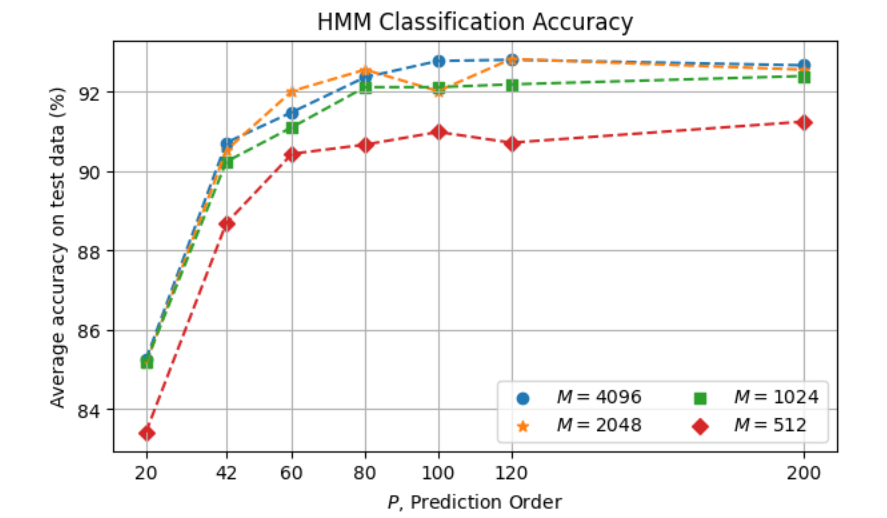

Classification accuracy reaches a plateau from $P = 80$ for $M \ge 1024$.
The maximum accuracy obtained is 92.88% with $P = 120$ and $M = 4096$.

With $P = 120$, the following parallel coordinates plot shows the effect of
$N$ (number of states), $M$ (number of symbols)
and $I$ (number of Baum-Welch refinement iterations):

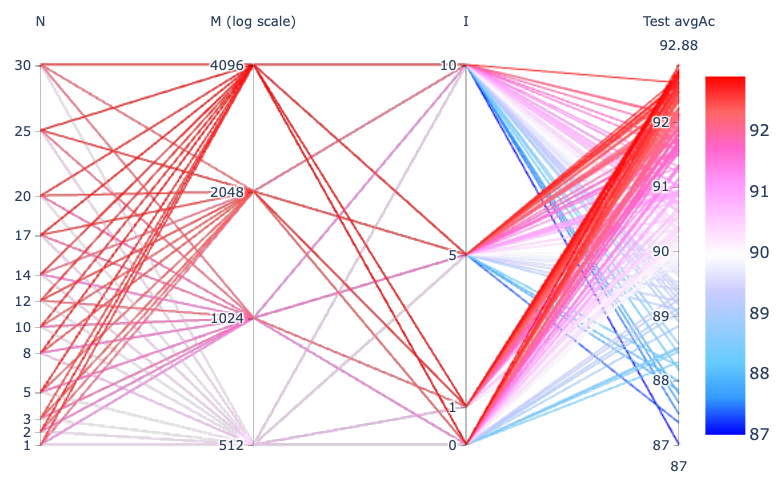

In general, we observe that accuracy is adversely impacted with greater $I$ values,
which suggests that the initial phase in the HMM training may be enough to provide
most of the discrimination power on our small dataset, i.e., the extra refinement
iterations tend to make the model incur overfitting.

With $I = 1$ from the above plot, the following visualizes the results in more detail:

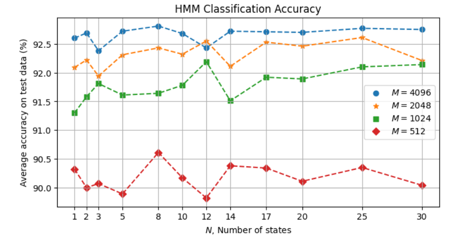

In general, we can see that accuracy increases with larger codebooks.
The number of states, however, does not appear to have a clear effect in general.
This suggests that the given training data is insufficient to take better advantage of HMM.
The maximum accuracy is ~92.8% with $M = 4096$ for various values of $N$.

As an example, with $N = 8$ and $M = 4096$, here is the resulting confusion matrix
with the 8 HMM models over the 2271 test instances:

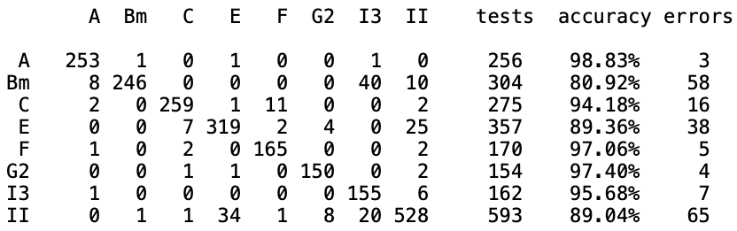

### Accuracy as function of W and O

We also investigated the effect of the analysis window size $W$
and offset $O$ used for the LPC analysis.
For this evaluation we selected a few $(W, O)$ combinations
and used $P = 120$ and the Naive Bayes classifier.

(Note: In this particular evaluation, we used a partition of the dataset
into 80% for training and 20% for testing.
Although the absolute accuracy values here are not directly comparable
with the other evaluations, in this case we are mainly interested in
the relative effect across the different $W$ and $O$ values.)

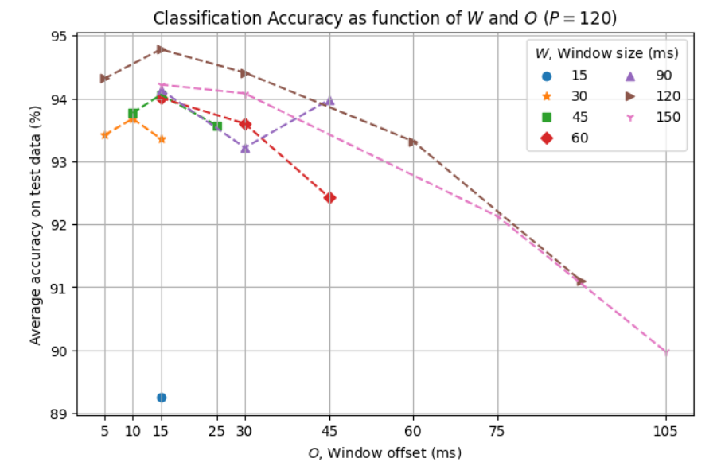

This result shows a consistent effect of the offset parameter across the various window sizes,
with significant adverse impact on accuracy with larger values and with $O = 15$ ms providing
the best performance in these tests.
In terms of window size we note an increase in accuracy with increasing $W$ value up to 120 ms
but then reduced with $W = 150$ ms.

## Summary of Accuracy per Method

- As a function of $P$:

    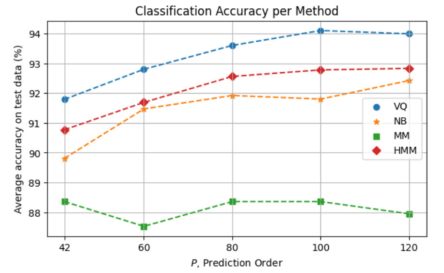

- In terms of accuracy error, the overall method comparison is as follows:

    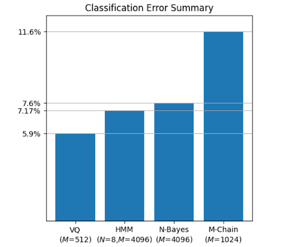
